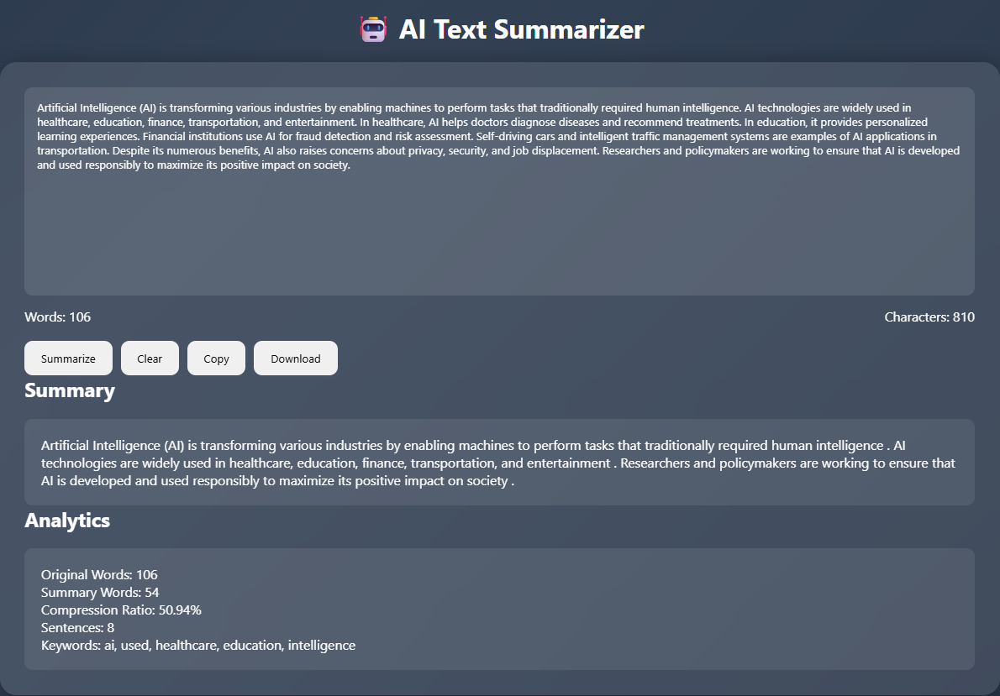

# AI Text Summarizer

## Output

<p align="center">
  
</p>


An AI-powered Text Summarizer web application built using Flask, Transformers, NumPy, Scikit-Learn, HTML, CSS, and JavaScript. The application generates concise summaries from lengthy text, extracts important keywords using TF-IDF, and provides useful text analytics through an interactive and modern user interface.

## Features

* AI-powered text summarization using Hugging Face Transformers
* Keyword extraction using TF-IDF
* Original and summary word count
* Character count
* Compression ratio calculation
* Sentence count analysis
* Copy summary to clipboard
* Download summary as TXT file
* Clear text functionality
* Loading animation
* Recent summary storage using Local Storage
* Responsive glassmorphism UI
* Premium dark theme design

## Tech Stack

### Backend

* Python
* Flask
* Transformers
* NumPy
* Scikit-Learn

### Frontend

* HTML
* CSS
* JavaScript

## Project Structure

text_summarizer/

├── app.py

├── summarizer.py

├── requirements.txt

├── README.md

├── .gitignore

├── templates/

│ └── index.html

└── static/

├── style.css

└── script.js

## Installation

### Clone Repository

```bash
git clone https://github.com/your-username/AI-Text-Summarizer.git
cd AI-Text-Summarizer
```

### Create Virtual Environment

```bash
python -m venv venv
```

### Activate Virtual Environment

Windows:

```bash
venv\Scripts\activate
```

### Install Dependencies

```bash
pip install -r requirements.txt
```

### Run Application

```bash
python app.py
```

Open your browser and visit:

```text
http://127.0.0.1:5000
```

## How It Works

1. Enter or paste a long text.
2. Click the Summarize button.
3. The Transformer model generates a concise summary.
4. TF-IDF extracts the most important keywords.
5. Analytics are displayed, including word count, compression ratio, and sentence count.
6. Users can copy or download the generated summary.

## Future Enhancements

* Multiple summarization models
* PDF and DOCX summarization
* User authentication
* Summary history database
* Speech-to-text support
* Text-to-speech summaries
* Export summaries as PDF

## Author

Developed as a Full-Stack AI and NLP project using Flask and Hugging Face Transformers.
